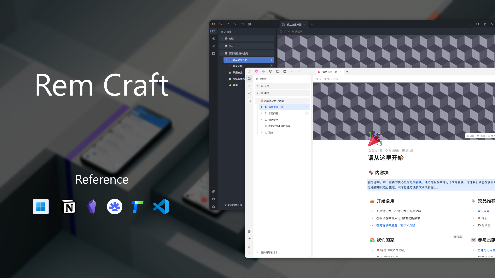

# Rem Craft


一款现代化、平面化设计的思源笔记主题



## 参考样式

以下是主要样式设计来源：

- 参考了[Semi Design](https://semi.design/zh-CN)的设计系统，统一了颜色、线条、圆角等变量
- 参考了Windows 11的设计，修改了主色、边栏、滑条、开关、输入框
- VS Code 的顶栏
- Craft 的呼出菜单、引述块
- Rem Note 的文档树
- Logseq 的页签
- Notion 的题头图、面包屑、编辑器各类块

## 参考项目

- 参考了[Achuan-2](https://github.com/Achuan-2)大佬的[Tsundoku Light](https://github.com/Achuan-2/siyuan-themes-tsundoku-light)主题中的超链接自动展示图标功能

## 更改日志

[CHANGELOG](./src/docs/CHANGELOG.md)

---

> 以下内容仅与自定义主题有关，建议有兴趣的朋友在[Github仓库地址](https://github.com/zqhjl/Rem-Craft)浏览，而非主题集市详情页内。

## ❗注意：激进变更

该主题是自用，因此有部分对其他用户来说可能过于**激进的变更**，如果你希望取消以下更改，需要了解[自定义步骤](#自定义步骤)后进行[取消更改操作](#取消更改操作)：

1. 设置、搜索、笔记本设置等大宽度菜单的关闭键被隐藏（点击菜单四周的空白处即可关闭）
2. 编辑器输入区域的宽度写死了，目前为47vw

## 自定义步骤

1. 在[Node.js](https://nodejs.org/zh-cn/)官网下载并安装
2. 克隆[本仓库](https://github.com/zqhjl/Rem-Craft)到本地，并更换到`dev`分支（此步骤建议使用 Github Desktop）
3. 在该仓库的根目录路径下，打开命令行工具，运行`npm i`
4. 等待依赖安装完成后，运行`npm run build`
5. 不关闭命令行工具，查看[_variables.scss](./src/styles/_variables.scss)文件，其中包含了所有更改样式的相关颜色和部分共用样式，请按照自己的需求自行修改

## 取消更改操作

以下相关操作与[激进变更](#注意)按序号对应：

1. 相关代码在[_dialog.scss](./src/styles/components/surface/_dialog.scss)文件中，结构如下所示，注释后编译即可取消
     ```css
    .b3-dialog__close {
      display: none;
    }
    ```
2. 可通过修改[_variables.scss](./src/styles/_variables.scss)文件中的`$rc-editor-width`变量调整

> 以上就是本菜鸡摸索出来的流程，也许之后我会开发一个主题自定义挂件，应该就不需要这么多复杂的步骤了…不过估计使用该主题的人不多，所以应该会鸽很久
